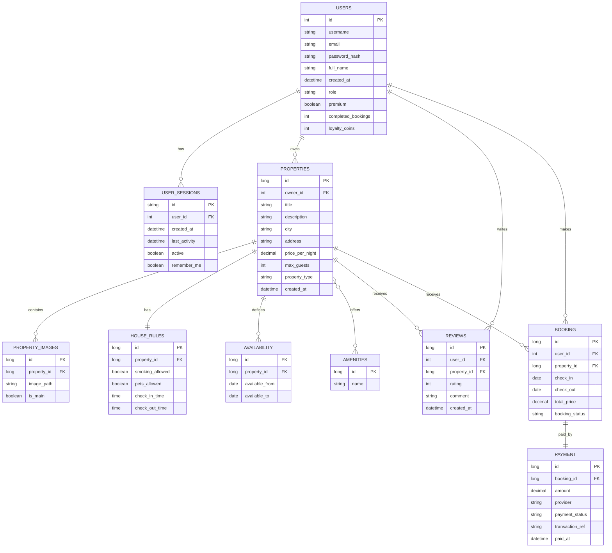

# StayEasy — Web Application for Accommodation Reservations

**StayEasy** is a web application for managing accommodation properties and reservation-related flows, inspired by platforms such as Airbnb and Booking. The application supports user authentication, property management, property details, reviews, pagination/sorting, validation, logging, a demo Premium account system, a StayEasy Coins loyalty system and an intelligent review summary generated through the Gemini API.

The project can be run in two forms:

1. **Monolithic / single-port version** — the main project from the public repository, using one Spring Boot backend and one Angular frontend.
2. **Microservices presentation version** — the project split into 3 independent services for demonstrating the optional AWBD microservices architecture requirements.

## Table of Contents

- [1. Main Features](#1-main-features)
- [2. Technology Stack](#2-technology-stack)
- [3. Architecture](#3-architecture)
- [4. Data Model and ERD Notes](#4-data-model-and-erd-notes)
- [5. Covered AWBD Requirements](#5-covered-awbd-requirements)
- [6. Local Setup — Monolithic Version](#6-local-setup--monolithic-version)
- [7. Local Setup — Microservices Version](#7-local-setup--microservices-version)
- [8. API Overview](#8-api-overview)
- [9. Testing and Coverage](#9-testing-and-coverage)
- [10. Logging](#10-logging)
- [11. AI in Development and AI at Runtime](#11-ai-in-development-and-ai-at-runtime)
- [12. Recommended Screenshots for Presentation](#12-recommended-screenshots-for-presentation)
- [13. Deployment](#13-deployment)
- [14. Team Contributions](#14-team-contributions)
- [15. Security Notes](#15-security-notes)

---

## 1. Main Features

- User registration and login.
- Authentication with **Spring Security + JWT**.
- Persistent user sessions stored in the database, with `sessionId` included in the JWT.
- Session expiration after inactivity.
- **Remember me** option, using a different session/token duration.
- User roles: `GUEST`, `HOST`, `ADMIN`.
- Automatic promotion from `GUEST` to `HOST` after the user adds their first property.
- CRUD operations for properties, with related images, amenities and house rules.
- Security restrictions: a property can be updated/deleted only by its owner or by an administrator.
- Property listing, filtering, searching, pagination and sorting.
- Property reviews, with the rule “one review per user per property”.
- Review deletion only by the review author or by an administrator.
- Admin audit page for user sessions.
- Demo **Premium** account system.
- **StayEasy Coins** loyalty system:
  - normal user: 1 coin for every 5 simulated completed bookings;
  - Premium user: 2 coins for every 5 simulated completed bookings;
  - 5 coins can be used for a demo 10% discount.
- Gemini API integration for automatically generating a summary of the reviews of a property.

---

## 2. Technology Stack

### Backend

- Java 21
- Spring Boot 3.3.5
- Spring Web
- Spring Data JPA
- Spring Security
- JWT — `io.jsonwebtoken`
- Bean Validation — `jakarta.validation`
- MySQL for development/demo profile
- H2 in-memory database for tests
- JUnit 5 + Mockito
- SLF4J + Logback
- Spring Cloud OpenFeign in the microservices version

### Frontend

- Angular 20
- TypeScript
- RxJS
- Angular Router
- Angular HTTP interceptor for JWT
- Angular forms and client-side validation

### Database

- MySQL / Railway for development and demo
- H2 for automated tests

---

## 3. Architecture

### 3.1 Monolithic / single-port version

In the normal version, the application runs as an integrated Spring Boot + Angular application:

```text
Browser
  |
  | Angular UI
  v
Spring Boot REST API + Security + Business Services
  |
  v
MySQL / Railway
```

The Angular frontend can be run separately on `localhost:4200` during development, or it can be built and served by Spring Boot for the single-port demo mode.

### 3.2 Microservices version

For the optional AWBD requirements, the application was split into 3 services running on different ports:

```text
Angular Frontend — localhost:4200
  |
  | proxy.conf.json
  |
  +--> StayEasy Auth Service — localhost:8081
  |       - authentication
  |       - register/login/logout
  |       - user sessions
  |       - premium status
  |       - admin audit
  |
  +--> StayEasy Core Service — localhost:8082
  |       - properties
  |       - search, pagination, sorting
  |       - house rules
  |       - amenities
  |       - demo booking / loyalty coins
  |       - call to AI Service through OpenFeign
  |
  +--> StayEasy AI / Reviews Service — localhost:8083
          - reviews
          - review rating summary
          - Gemini API review summary
```

Communication is handled as follows:

- The frontend uses `proxy.conf.json` to route requests to the correct service.
- Core Service calls AI Service through **OpenFeign** for the AI summary endpoint.
- In the presentation version, the services use the same MySQL database for simplicity and demo consistency.

---

## 4. Data Model and ERD Notes

The ERD keeps both the implemented structure and the intended scalability direction of the application.



### Important notes about the ERD tables

In the current implementation, the active tables used by the main application flows are:

- `USERS`
- `USER_SESSIONS`
- `PROPERTIES`
- `PROPERTY_IMAGES`
- `AMENITIES`
- `HOUSE_RULES`
- `REVIEWS`

These are the tables for which the application provides direct or indirect management / CRUD through the existing flows.

The `AVAILABILITY` table exists in the JPA model and in the database, but it is not yet used in the final application flow. It was intentionally kept in the ERD and in the model as an extension point for a future real availability calendar for each property.

The `BOOKING` and `PAYMENT` tables appear in the ERD as development and scalability directions. In the current implementation, there are no persistent JPA entities named `Booking` and `Payment`. The current booking flow is a demo flow used for the loyalty coins system: the user can press `Book Now` and the application updates the number of completed bookings and the user’s coins. Full persistence for bookings and payments can be added later without changing the architectural direction of the project.

Therefore, the ERD was not artificially simplified. It documents both the current implementation and the natural evolution of the application toward real reservations and payments.

---

## 5. Covered AWBD Requirements

### Mandatory requirements

| Requirement | Status | Notes |
|---|---:|---|
| Data model with at least 6-7 entities | Implemented | The model includes users, sessions, properties, images, amenities, house rules, availability and reviews. |
| Multiple JPA relationship types | Implemented | `OneToOne`, `OneToMany`, `ManyToOne`, `ManyToMany`. |
| CRUD / entity management | Implemented | Properties, images, amenities and house rules through Property API; reviews through Review API; users/sessions through auth/admin flows. |
| Repository pattern | Implemented | Spring Data JPA repositories. |
| Service layer | Implemented | Business logic is separated into service classes. |
| Exception handling | Implemented | Custom exceptions and `GlobalExceptionHandler`. |
| Multi-environment configuration | Implemented | `dev/local` profile for MySQL and `test` profile for H2. |
| Testing | Implemented | Unit tests with JUnit 5 + Mockito and integration tests. |
| Views and validation | Implemented | Angular UI, forms, client-side and server-side validation. |
| Logging | Implemented | SLF4J + Logback, console output, general log file and error log file. |
| Pagination and sorting | Implemented | Paged endpoints for properties, reviews and admin sessions. |
| Spring Security | Implemented | JWT, BCrypt, roles, session validation, remember me, logout. |

### Optional / bonus requirements

| Optional requirement | Status | Notes |
|---|---:|---|
| Minimum 3 microservices | Implemented | Auth, Core, AI/Reviews. |
| Communication between services | Partially implemented | Angular proxy + OpenFeign Core → AI. |
| Distributed security | Partially implemented | JWT is verified at the Spring Security level in the services. |
| AI Agents — development | Documented | AI was used as support for development, debugging, test generation and documentation. |
| AI Agents — runtime | Implemented | Gemini API generates an intelligent review summary. |
| Deployment | To be completed | The public link must be added after deployment. |

---

## 6. Local Setup — Monolithic Version

### 6.1 Clone the repository

```bash
git clone https://github.com/VictorE076/StayEasy-App.git
cd StayEasy-App/stayeasy-springangular
```

### 6.2 Local configuration

Create a local configuration file based on the provided example:

```bash
cp src/main/resources/application-example.properties src/main/resources/application-local.properties
```

Fill in the local values using environment variables or `application-local.properties`:

```properties
SPRING_PROFILES_ACTIVE=dev,local
DB_URL=jdbc:mysql://HOST:PORT/DATABASE_NAME
DB_USERNAME=USERNAME
DB_PASSWORD=PASSWORD
JWT_SECRET=YOUR_LONG_SECRET_KEY
JWT_EXPIRATION=3600000
SESSION_TIMEOUT_MINUTES=15
GEMINI_API_KEY=YOUR_GEMINI_API_KEY
GEMINI_API_URL=https://generativelanguage.googleapis.com/v1beta/models/<MODEL_NAME>:generateContent?key=
```

Files containing passwords, tokens, API keys or private URLs must not be pushed to the repository.

### 6.3 Run the backend

```bash
mvn spring-boot:run
```

The backend runs by default on:

```text
http://localhost:8080
```

### 6.4 Run the frontend in development mode

```bash
npm install
npm start
```

The frontend runs on:

```text
http://localhost:4200
```

### 6.5 Run the single-port demo mode

For an Angular build served by Spring Boot:

```bash
npm run build
mvn spring-boot:run
```

In this mode, the application can be accessed through the Spring Boot backend.

---

## 7. Local Setup — Microservices Version

The microservices version is included in the AWBD presentation archive/project and contains 3 separate Spring Boot projects:

```text
AWBD-Microservicii/
  Proiect AWBD-Microservicii_prezentare/
    StayEasy-Auth_prezentare/
    StayEasy-Core_prezentare/
    StayEasy-AI_prezentare/
```

### 7.1 Ports

| Service | Port | Responsibility |
|---|---:|---|
| StayEasy Auth Service | 8081 | authentication, register/login/logout, sessions, premium, admin audit |
| StayEasy Core Service | 8082 | properties, demo booking, loyalty coins, call to AI Service |
| StayEasy AI / Reviews Service | 8083 | reviews, review summary, Gemini AI summary |
| Angular Frontend | 4200 | user interface |

### 7.2 Start the services

Open one terminal for each service.

Auth Service:

```bash
cd StayEasy-Auth_prezentare/stayeasy-springangular
mvn spring-boot:run
```

Core Service:

```bash
cd StayEasy-Core_prezentare/stayeasy-springangular
mvn spring-boot:run
```

AI / Reviews Service:

```bash
cd StayEasy-AI_prezentare/stayeasy-springangular
mvn spring-boot:run
```

Angular Frontend, preferably from the Core project:

```bash
cd StayEasy-Core_prezentare/stayeasy-springangular
npm install
npm start
```

The frontend uses `proxy.conf.json`:

```json
{
  "/api/auth": "http://localhost:8081",
  "/api/users": "http://localhost:8081",
  "/api/premium": "http://localhost:8081",
  "/api/admin": "http://localhost:8081",
  "/api/properties": "http://localhost:8082",
  "/api/bookings": "http://localhost:8082",
  "/api/reviews": "http://localhost:8083"
}
```

### 7.3 Note about Core → AI communication

Core Service uses a Feign Client to call AI Service:

```java
@FeignClient(name = "StayEasy-Ai", url = "http://localhost:8083")
```

This means that when the frontend requests the AI summary of a property through Core, Core calls the AI/Reviews service, and that service generates the text through the Gemini API.

---

## 8. API Overview

### Auth Service — `localhost:8081`

| Method | Endpoint | Description |
|---|---|---|
| POST | `/api/auth/register` | register a new user |
| POST | `/api/auth/login` | authenticate user and generate JWT |
| POST | `/api/auth/logout` | close the current session |
| GET | `/api/premium/status` | check premium status |
| POST | `/api/premium/activate-demo` | activate demo premium |
| POST | `/api/premium/deactivate-demo` | deactivate demo premium |
| GET | `/api/admin/audit/sessions` | list user sessions for admin |
| GET | `/api/admin/audit/sessions/paged` | paginated admin sessions |

### Core Service — `localhost:8082`

| Method | Endpoint | Description |
|---|---|---|
| GET | `/api/properties` | list properties |
| GET | `/api/properties/paged` | paginated and sorted property list |
| GET | `/api/properties/{id}` | basic property details |
| GET | `/api/properties/{id}/details` | extended property details |
| GET | `/api/properties/search` | search by city/price |
| POST | `/api/properties` | create property |
| PUT | `/api/properties/{id}` | update property |
| DELETE | `/api/properties/{id}` | delete property |
| GET | `/api/properties/{id}/ai-summary` | AI summary through AI Service call |
| POST | `/api/bookings/book-now/{propertyId}` | demo booking / add loyalty progress |
| POST | `/api/bookings/book-discount/{propertyId}` | demo booking with coins discount |
| GET | `/api/bookings/my-loyalty` | loyalty coins status |

### AI / Reviews Service — `localhost:8083`

| Method | Endpoint | Description |
|---|---|---|
| GET | `/api/reviews/properties/{propertyId}` | list reviews |
| GET | `/api/reviews/properties/{propertyId}/paged` | paginated reviews |
| PUT | `/api/reviews/properties/{propertyId}` | create or update review |
| DELETE | `/api/reviews/{reviewId}` | delete review |
| GET | `/api/reviews/properties/{propertyId}/summary` | average rating + number of reviews |
| GET | `/api/reviews/summary/{propertyId}` | semantic summary generated with Gemini |

---

## 9. Testing and Coverage

Testing is implemented with:

- JUnit 5
- Mockito
- Spring Boot Test
- H2 in-memory database for the `test` profile

Run backend tests:

```bash
mvn test
```

The test profile uses:

```properties
spring.datasource.url=jdbc:h2:mem:testdb
spring.jpa.hibernate.ddl-auto=create-drop
```

The project includes service layer tests and integration tests. For the AWBD demonstration, service layer coverage was checked in IntelliJ IDEA, and the `Service` package exceeds the 70% threshold in the versions prepared for presentation.

Example test classes:

- `PropertyServiceTest`
- `BookingServiceTest`
- `ReviewServiceTest`
- `UserSessionServiceTest`
- `DatabaseUserDetailsServiceTest`
- `PremiumServiceTest`
- `AdminAuditServiceTest`
- `GeminiServiceTest`
- `PropertyIntegrationTest`

---

## 10. Logging

Logging is configured with **SLF4J + Logback**.

Local log files:

```text
logs/stayeasy-app.log
logs/stayeasy-error.log
```

Characteristics:

- console logs;
- general application log file;
- separate error log file;
- daily rolling policy;
- relevant logs for business operations, security, AI summary generation and rejected operations.

Log files should not be pushed to the repository.

---

## 11. AI in Development and AI at Runtime

### AI used during development

During development, AI was used as an assistant for:

- explaining and refining errors;
- proposing unit tests;
- checking the README/documentation structure;
- suggesting responsibility separation;
- improving error messages and validation.

The final code was manually checked, adapted and integrated by the team.

### Runtime AI — Gemini Review Summary

The application includes a runtime feature based on the Gemini API:

1. the user opens a property details page;
2. the frontend requests the AI summary;
3. Core Service calls AI Service through Feign;
4. AI Service reads the reviews of the property;
5. Gemini generates a short, objective summary in 3 main ideas;
6. the summary is displayed in the UI.

If there are no reviews or if the Gemini API does not respond, the application returns a user-friendly message and does not block the page.

---

### Possible deployment options

- Railway / Render for backend and database;
- Docker Compose for controlled local deployment;
- separate deployment for frontend and backend;
- for microservices: one deployed service for Auth, one for Core and one for AI/Reviews.

---

## 14. Team Contributions

### Victor Economu

- Spring Security + JWT configuration;
- user sessions and `sessionId` validation;
- logout and handling invalid/expired sessions;
- exception handling and logging;
- Gemini AI Review Summary integration;
- microservices integration for the Core → AI flow;
- README documentation and AWBD demo preparation.

### Alexandru-Mihail Radu

- property model and property business logic;
- review functionality and property details;
- StayEasy Coins / loyalty flow;
- demo Premium account and coins integration;
- unit tests and service layer coverage improvements;
- checks and adjustments for the mandatory AWBD requirements.

---

## 15. Security Notes

- Local files containing passwords, private URLs, JWT secrets or API keys must not be published.
- `application-local.properties` should remain local and should be included in `.gitignore`.
- In a public repository, only `application-example.properties` with placeholders should be kept.
- If an API key or secret was accidentally included in an archive or commit, it should be revoked/rotated before publishing the project.
- For production, environment variables are recommended.

---

## University Context

Project developed for **Web Applications for Databases / Web Applications with Microservices Architecture**, Faculty of Mathematics and Computer Science, University of Bucharest.
