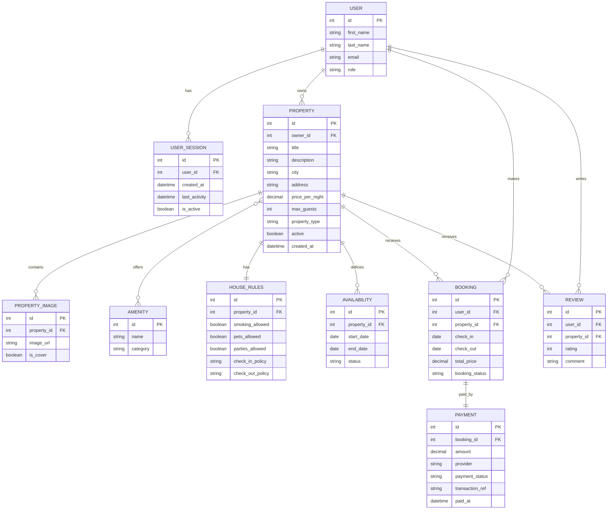

# StayEasy-App

## General Description

**StayEasy** is a web application designed for managing tourist accommodations and reservations, inspired by platforms such as Airbnb or Booking. The system allows users to search for properties, view detailed information, make bookings, process payments and leave reviews. At the same time, property owners can add and manage listings, while administrators can monitor certain aspects of the platform. The web platform, developed using **Java (Spring Boot)** and **Angular** as part of few university projects, aims to simplify property and booking management by providing an intuitive web interface for multiple user types.

## ER Diagram

## Functional Requirements

The application must fulfill the following functional requirements:

1. The system must allow user registration and authentication.
2. The system must manage user sessions and session expiration after a period of inactivity.
3. All users must be able to add, edit, and delete their own properties.
4. Each property must be able to have associated images.
5. Each property must have a set of accommodation rules.
6. The system must allow the definition of availability periods for each property.
7. Users must be able to search for and view available properties.
8. Users must be able to filter properties by criteria such as city, price, property type, or maximum number of guests.
9. Users must be able to view full details of a property.
10. Users must be able to make bookings for available properties.
11. The system must calculate the total booking price based on the selected period.
12. The system must allow payments associated with bookings.
13. The system must store information about payment status and transaction reference.
14. Users must be able to leave reviews and ratings for booked properties.
15. The system must allow displaying the reviews associated with each property.
16. Properties must be able to have associated amenities, such as Wi-Fi, parking, or air conditioning.
17. The system must allow differentiation of users by roles, such as guest, host, and administrator.
18. The administrator must be able to monitor users and certain activities within the platform.

## Notes

This ER Diagram represents the main database structure for the **StayEasy** application and highlights the essential entities, their attributes, and the relationships between them. The list of functional requirements can be extended later depending on the final project requirements and any additional implemented features.

## Technologies & Tools
  - Frontend: **Angular**
  - Backend: **Spring Boot**
  - Database: **MySQL** (Railway Cloud Service)
  - Authentication: **Spring Security** + **JWT**
  - Payments: **Integration with an external payment provider**
  - Other tools: **Jira / Trello / ClickUp, JUnit, Postman, Spring DevTools**

## Technological Versions
  - **Java:** OpenJDK 21.0.2  
  - **Maven:** 3.9.6  
  - **Spring Boot:** 3.3.5  
  - **Node.js:** 20.19.5  
  - **npm:** 10.8.2  
  - **Angular:** 20.3.9 (CLI 20.3.8)  
  - **TypeScript:** 5.9.3  
  - **RxJS:** 7.8.2  
  - **Zone.js:** 0.15.1
  - **MySQL:** 9.5.0

## Development Modes
  - **Dev Mode**
      - **npm start** (Angular, port **4200**) + **mvn spring-boot:run** (Spring, port **8080**)
  - **Demo Mode** (checkpoint presentations)
      - **npm run build** + **mvn spring-boot:run**
      - Single server on port **8080**

## Local Configuration Setup

This project uses an `application.properties` file for sensitive configuration (DB credentials, JWT secret, etc.), which is **not included in the repo** for security reasons.

After cloning the project, follow these steps:

1. Navigate to: **src/main/resources/**
2. Copy the example file: **application-example.properties** and rename the copy to **application.properties**
3. Open the new `application.properties` file and fill in your local credentials:
- `spring.datasource.url` → MySQL/Railway connection URL  
- `spring.datasource.username` → DB username  
- `spring.datasource.password` → DB password  
- `application.security.jwt.secret` → Any long random string (used as JWT signing key)  
- `application.security.jwt.expiration` → Token expiration time in ms (default: 3600000ms = 1h)

⚠️ **IMPORTANT:**  
Do **NOT** commit or push your local `application.properties` file.  
It is listed in `.gitignore` and should remain local only.

## University Context
  - Faculty of Mathematics and Computer Science, University of Bucharest
  - Team Project
